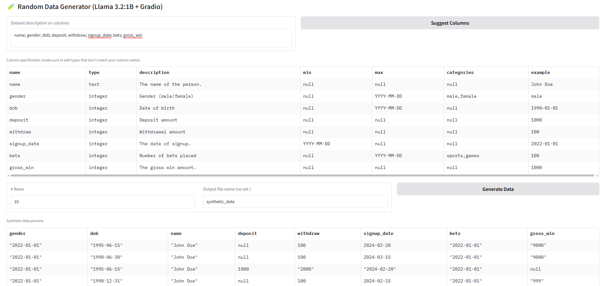

# 🎲 Random Data Generator

A powerful synthetic data generation tool powered by Llama 3.2 (1B) and Gradio, designed to create realistic datasets with intelligent field relationships and data coherence.



## ✨ Features

- 🤖 **AI-Powered Schema Understanding**: Uses Llama 3.2 to intelligently interpret your data requirements
- 🔄 **Smart Field Relationships**: Maintains logical connections between related fields (e.g., age matching DOB)
- 📊 **Flexible Data Types**: Supports text, dates, categorical, integer, and float data types
- 🎯 **Intelligent Constraints**: Automatically suggests appropriate ranges and categories
- 🌈 **User-Friendly Interface**: Built with Gradio for an intuitive user experience
- 📝 **Editable Specifications**: Fine-tune the generated schema before data creation
- 📤 **Multiple Export Formats**: Export to Excel or CSV

## 🚀 Getting Started

### Prerequisites

- Python 3.8+
- [Ollama](https://ollama.ai/) with Llama 3.2 (1B) model installed

### Installation

1. Clone the repository:
```bash
git clone https://github.com/oneovernever/rand_data_gen.git
cd rand_data_gen
```

2. Install dependencies:
```bash
pip install -r requirements.txt
```

3. Make sure Ollama is running with Llama 3.2:
```bash
ollama run llama3.2:1B
```

4. Run the application:
```bash
python app.py
```

## 🎮 Usage

1. **Describe Your Dataset**: Enter a description of your desired dataset or list the columns you want
2. **Click "Suggest Columns"**: The AI will analyze your requirements and suggest appropriate column specifications
3. **Adjust if Needed**: Fine-tune the generated specifications in the editable table
4. **Set Row Count**: Choose how many rows of data you want to generate
5. **Generate**: Click "Generate Data" to create your synthetic dataset
6. **Export**: Download the generated data in your preferred format

### Example Input

```
name; gender; dob; deposit; withdraw; signup_date; transfers; payments
```

## 🛠️ Technical Details

- **LLM Integration**: Uses Llama 3.2 (1B) via Ollama for intelligent schema analysis
- **Data Generation**: Combines AI-guided and rule-based approaches for realistic data
- **Field Dependencies**: Automatically maintains relationships between related fields
- **Validation**: Ensures generated data meets specified constraints and relationships

## 📝 License

This project is licensed under the MIT License - see the [LICENSE](LICENSE) file for details.

## 🤝 Contributing

Contributions are welcome! Please feel free to submit a Pull Request.

## 🙏 Acknowledgments

- Built with [Gradio](https://gradio.app/)
- Powered by [Llama 3.2](https://ollama.ai/library/llama3.2)
- Inspired by the need for intelligent synthetic data generation 
